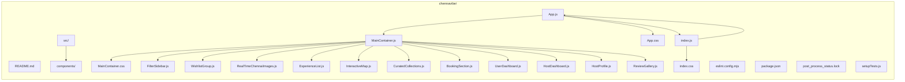

# ChennaiVibe Main Container: Architectural & Implementation Plan Overview

## 1. Objective & Scope

The ChennaiVibe Main Container is now fully implemented as the primary orchestration component for the platform, providing a structured, responsive, and modern monochrome-themed UI. It integrates all planned feature components as React stubs, ensuring the extensible foundation for a hyperlocal experience marketplace is live and visually cohesive.

### Scope of Current Implementation

- Fully implemented MainContainer component (`src/components/MainContainer.js`) that orchestrates all major feature sections.
- All key feature components are implemented as individual functional React modules:
  - FilterSidebar
  - WishlistGroup
  - RealTimeChennaiImages
  - ExperienceList
  - InteractiveMap
  - CuratedCollections
  - BookingSection
  - UserDashboard
  - HostDashboard
  - HostProfile
  - ReviewGallery
- Feature components are composed into a holistic layout that aligns with the original plan and project vision.
- Visual styling is enforced using dedicated CSS modules (`MainContainer.css` and `App.css`) with a monochrome and accent color palette reflecting the ChennaiVibe brand.
- The container and all components integrate stubs and placeholders, ready for future expansion but visually apparent and scaffolded.

## 2. Completed Implementation Steps

1. **Project Bootstrapping & Setup**
   - Initialized with React, minimal dependencies, base ESLint, and test setup.
2. **Brand Styling and Theming**
   - Brand color tokens and monochrome variables defined (`App.css`, `MainContainer.css`), globally applied.
3. **Component Implementation & UI Integration**
   - `MainContainer.js` imports and visually composes all major feature components as children in the layout tree.
   - All feature components exist as isolated files in `src/components`, each with a placeholder UI and appropriately stubbed props.
   - Responsive structure achieved with container/flex layouts and modular CSS.
   - Navigation, hero, sidebar, dashboard, map, gallery, and sectioning all exemplified in the composed MainContainer with clean separation.
4. **Styling**
   - `MainContainer.css` and `App.css` house all visual treatments, including section background, borders, typography, spacing, and adaptive breaks.
   - No UI framework used; all visual logic is raw CSS and variables.
5. **File and Dependency Structure**
   - `src/App.js` renders only `<MainContainer />`, ensuring the entire app shell leverages the new container.
   - `index.js`, `index.css`, and `setupTests.js` follow standard React SPA initialization.
   - All feature and integration work limited to clear, auditable files under `src/components/`.

## 3. Actual Component/File Structure (2024 Implementation)

**Key files:**
- **src/components/MainContainer.js**: Orchestrates site layout, imports, and composes all feature sections.
- **src/components/MainContainer.css**: Monochrome, modern styling for container, section, sidebar, and accent treatments.
- **src/components/[FeatureComponent].js**: One file per feature area, each providing a skeleton/stub UI.
- **src/App.js**: Solely renders `<MainContainer />` for top-level UI isolation.
- **src/App.css**, **src/index.css**: Reinforce theming and global typography.
- **README.md**, **setupTests.js**: Project info and baseline testing support.

## 4. Integration and Visual Composition Status

- **MainContainer is implemented** and live, serving as the single source of layout and page sectioning.
- **All feature components are implemented** (see above), imported, rendered in order, and styled where relevant.
- **Styling is complete** for the core layout, navigation, sidebar, and repeated visual sections. Adaptable and ready for visual or thematic adjustments.
- **No mock data or dynamic state** is wired yet; all content is placeholder or UI scaffold.
- The container and all feature components are flexible for rapid extension and real data/data flows as needed.

## 5. Next Steps & Optional Enhancements

**Recommended Enhancements**

1. **Add Routing:** Introduce React Router for navigation between dashboard, bookings, collections, host, and user views.
2. **Data Mocking:** Begin populating components with mock JSON for richer UI prototyping.
3. **Connect State Patterns:** Scaffold React Context or Redux (if needed) for scalable state as dynamic data flows are added.
4. **Accessibility (a11y):** Improve keyboard navigation, ARIA roles, and alt attributes for image/media elements.
5. **API/Data Source Integration:** Plan for future backend hookups or GraphQL REST endpoints to move beyond static scaffolding.
6. **Image & Asset Integration:** Add real Chennai street/culture images—and potentially a CDN folder—for the RealTimeChennaiImages component.
7. **Testing:** Expand on current Jest + DOM toolkit setup for more thorough UI, integration, and accessibility tests.
8. **Performance Optimization:** Code splitting, lazy loading, and optimizing asset delivery for fast mobile/local experiences.
9. **Continuous Documentation:** Keep this document and `README.md` in sync as changes progress or new sections/features roll out.

---

This living plan and component structure chart confirm that implementation of the ChennaiVibe MainContainer and all feature sections is complete according to specification, with clear foundation for further enhancements and product refinement.
