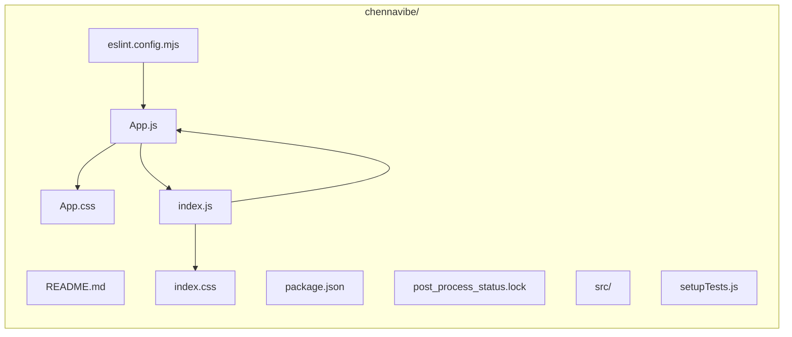

# ChennaiVibe Main Container: Architectural & Implementation Plan Overview

## 1. Objective & Scope

The ChennaiVibe Main Container serves as the foundation for a hyperlocal web platform connecting Gen Z and Millennials with unique experiences across Chennai. This React-based single-page application (SPA) aims to provide a fast, lightweight, and visually cohesive entry point for features like experience listings, host profiles, bookings, reviews, curated collections, and more. 

The scope of the current implementation includes:
- Establishing project structure and configuration for scalable frontend feature growth.
- Designing a modern container and navigation bar that reflects the brand’s identity.
- Setting up centralized theming with a dark/gray/black palette and clear accent colors.
- Preparing the groundwork for future integrations such as maps, booking systems, host dashboards, and user interaction.

## 2. Step-by-Step Task Breakdown

1. **Project Bootstrapping**
   - Initialize a React JS project using minimal dependencies (see `package.json`, `README.md`).
   - Configure ESLint for consistent code quality (`eslint.config.mjs`).

2. **Theme & Brand Styling**
   - Define brand colors and CSS variables in `src/App.css`:
     - Primary: “--kavia-orange” (`#E87A41`)
     - Surface: “--kavia-dark” (`#1A1A1A`)
     - Text and border colors for clarity and visual hierarchy.
   - Use pure CSS without third-party frameworks for performance and simplicity.

3. **Core File and Component Layout**
   - Implement the `App` component (`src/App.js`) as the main UI controller:
     - Fixed top navigation bar with brand logo and example button.
     - Main content area with a hero section, project title, subtitle, and action button placeholder.
   - Encapsulate layout within responsive container classes (see `.container` in `App.css`).
   - Provide structure for adding further sections (e.g., experience listings, maps, user dashboards) in future iterations.

4. **Entry Point Configuration**
   - The root React renderer (`src/index.js`) mounts the `App` component to the DOM using `ReactDOM.createRoot`.
   - Base CSS resets and global styling are handled in `src/index.css` to ensure consistency.

5. **Testing Setup**
   - The project is preconfigured for Jest and DOM assertions (see `src/setupTests.js`) to support future test expansion.

6. **Documentation & Customization Support**
   - The platform’s customization points (branding, theming) are described in `chennavibe/README.md`.
   - The project encourages gradual feature/component addition, documented under a growing `kavia-docs` directory.

## 3. Component/File Structure Chart

- **chennavibe/src/App.js**: Main UI container and layout controller.
- **chennavibe/src/App.css**: Theming, responsive layout, and brand styles.
- **chennavibe/src/index.js**: SPA entry point, mounts the app to the root node.
- **chennavibe/src/index.css**: Global and reset styles.
- **chennavibe/src/setupTests.js**: Test environment setup for future test suites.
- **README files**: Explain features, setup, and customization.

## 4. Key Architectural & Theming Considerations

- **UI Simplicity and Performance**: The project intentionally does _not_ use heavy UI frameworks or dependencies, opting instead for vanilla CSS and a small, understandable file tree. This supports fast loading and easy further development.
- **Responsive, Modular Design**: The layout relies on flexible container classes (e.g., `.container`, `.hero`, `.navbar`), allowing rapid expansion as more features/components are added.
- **Theming & Brand Identity**: Brand colors and a monochrome palette are globally defined via CSS variables, ensuring consistency and ease of updates. Experience cards, navigation, and hero sections all reference these design tokens.
- **Extensibility**: With all main content encapsulated in the `App` container, modular expansion for curated experiences, maps, booking, reviews, and dashboards is seamless. There’s no vendor lock-in for styling or routing at this stage.

## 5. Notable Constraints & Next Steps

**Constraints**
- No backend integration or data models are yet included; all data/content is static or placeholder.
- No advanced routing or code-splitting is implemented in the starter.
- No external image assets are bundled—future real Chennai images will need sourcing and component integration.

**Recommended Next Steps**
1. **Component Expansion**: Begin modular development of core features (experience list, host profile, booking, maps).
2. **Routing**: Integrate React Router and organize routes for dashboard, host management, user collections, etc.
3. **Mock Data & UI Prototyping**: Scaffold mock JSON data and prototype future UI flows for collections, reviews, and bookings.
4. **Interactive & State Management**: Set up initial context providers or simple state handling as app complexity grows.
5. **Accessibility & Testing**: Implement accessibility improvements and expand on Jest/react-testing-library test cases.
6. **Continuous Documentation**: Update this document and in-project README(s) as new features are added.

---

This implementation plan is intended as both a technical onboarding reference and a living document supporting the rapid, consistent, and visually-appealing development of the ChennaiVibe platform.
